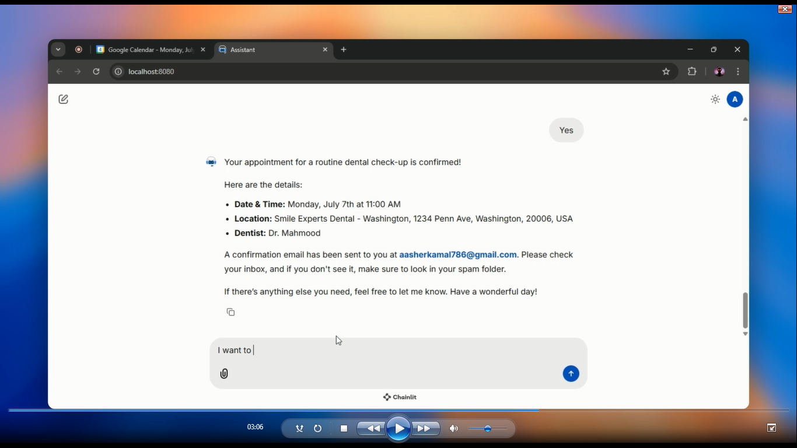

# Zentist: AI Dental Assistant

Zentist is a sophisticated, multi-agent AI assistant designed for dental clinics. It provides a seamless, conversational interface for patients to book, manage, and inquire about appointments. The backend is built with FastAPI and leverages a powerful multi-agent system to handle diverse user requests efficiently.

## Watch Demo

## ✨ Core Features

- **Multi-Agent Architecture**: The system uses specialized agents for different tasks:
    - **Receptionist Agent**: Handles initial greetings and general clinic inquiries (hours, services, doctors).
    - **Scheduler Agent**: Manages the entire appointment booking workflow.
    - **Canceling Agent**: Handles appointment cancellation requests.
    - **Seamless Handoffs**: Agents automatically transfer the conversation to the most appropriate specialist based on the user's intent.
- **Intelligent Tool Use**: Agents can use a variety of tools to perform actions in the real world:
    - **Google Calendar Integration**: Check for free slots and create/cancel appointments directly on a doctor's calendar.
    - **Database Integration**: Persists appointment data in a PostgreSQL database and retrieves it for management.
    - **Automated Email Notifications**: Uses SendGrid to send professional confirmation and cancellation emails to both patients and doctors.
- **Stateful Conversations**: Leverages Redis to maintain conversation history and agent state, allowing for natural, multi-turn interactions with users.
- **Secure & Authenticated**: Uses Supabase JWT for secure, role-based user authentication. Patients must be logged in to interact, and doctors can securely view their schedules.
- **Highly Configurable**: All clinic-specific information (doctors, services, hours, prompts) is managed via external configuration files (`data/clinic_info.json`), making the assistant easily adaptable to any dental practice.
- **Streaming API**: Provides a real-time, ChatGPT-like experience by streaming responses, tool usage, and agent handoffs to the client.

## 🏛️ Architecture Overview

The application follows a modern, service-oriented architecture.

1.  **Client (Frontend)**: Interacts with the backend via a REST API.
2.  **FastAPI Backend**: The core of the application, handling API requests.
3.  **Authentication**: A middleware intercepts requests to validate Supabase JWTs, identifying the user.
4.  **Chat Endpoint (`/chat/stream`)**:
    - Retrieves the user's conversation state from **Redis**.
    - Passes the message history to the current active **AI Agent**.
5.  **Multi-Agent System**:
    - The active agent (e.g., Receptionist) processes the user's request using an LLM (powered by Groq).
    - If the request requires a specialized task (e.g., "I want to book an appointment"), the agent **hands off** the conversation to a specialist (e.g., Scheduler Agent).
    - The specialist agent uses **Tools** to interact with external services.
6.  **Tools & External Services**:
    - `calendar_tools`: Interface with the **Google Calendar API**.
    - `email_tools`: Interface with the **SendGrid API**.
    - **Database Session**: Tools and endpoints interact directly with the **PostgreSQL Database** via SQLModel to persist data.
7.  **State Persistence**: After the interaction, the final conversation state (history and last active agent) is saved back to **Redis**.

## 🛠️ Tech Stack

-   **Backend**: FastAPI
-   **AI Agent Framework**: OpenAI Agents SDK with LiteLLM
-   **LLM Provider**: Groq
-   **Database**: PostgreSQL with SQLModel (ORM)
-   **Authentication**: Supabase (JWT)
-   **Caching / Session Store**: Redis
-   **External APIs**: Google Calendar API, SendGrid API
-   **Containerization**: Docker, Docker Compose
-   **Language**: Python 3.11+

## 📜 API Endpoints

-   `POST /api/v1/chat/stream`: The main endpoint for streaming chat interactions. Requires authentication.
-   `GET /api/v1/appointments/`: Retrieves appointments for the authenticated doctor. Supports `start_date` and `end_date` query parameters.
-   `GET /api/v1/config`: Provides public-facing configuration (Supabase keys) to the frontend.
-   `GET /health`: A simple health check endpoint.
